<!-- README.md is generated from README.Rmd. Please edit that file -->

```{r, include = FALSE}
knitr::opts_chunk$set(
  collapse = TRUE,
  comment = "#>",
  fig.path = "man/figures/",
  out.width = "100%"
)
```

# unCTC: Characterising single circulating tumor cell transcriptomes 

## Introduction

unCTC employs pathway-based unsupervised clustering of single-cell RNA-Seq data to identify circulating tumour cells (CTCs) among white blood cells (WBCs). It accepts a list of raw Countdata/TPM single-cell RNA-Seq expression matrices. In the expression matrix, genes must be aligned in rows, while cells must be in columns. unCTC integrates all matrices based on common genes, removes low-expression genes and cells, eliminates batch effects, and normalises the integrated matrix. For unsupervised clustering of circulating tumour cells (CTCs) and white blood cells (WBCs), a normalised matrix is translated to pathway space and deep dictionary learning with k-means clustering is implemented. unCTC also computes copy number variations (CNVs) , revealing the frequency of CNVs and the position of the p/q arm variation. Using Stouffer's Z-score, unCTC enables the detection of numerous canonical markers indicating malignant/epithelial/immune origins (Stouffer et al., 1949). The expression of other canonical markers confirms the lineage of circulating tumour cells (CTCs).


## Installation

You can install the released version of unCTC from ....  

```{r Load-unCTC-library, eval=F, echo=T}
#First, you need to install the devtools package. 
install.packages("devtools")

#Load the devtools package.
library(devtools)

#Install the unCTC package
install_github("SaritaPoonia/unCTC")

#Load unCTC
library(unCTC)
```

## Software Requirements
* R (tested in R version 4.0.3 (2020-10-10))  
* R libraries required include : PCAtools, viridis, magrittr, stringr, limma,
    rworldmap, data.table, GSVA, pheatmap, qusage, umap, ggplot2,
    SingleCellExperiment, Linnorm, readxl, readtext, infercnv, ggpubr,
    reticulate, GenomicRanges, readtext, S4Vectors, cowplot, edgeR, D3GB, 
    dplyr, SummarizedExperiment, IRanges, Matrix, utils,
    stats
* Python 3 with installed modules: h5py, scipy, pandas, numpy, sklearn,
  matplotlib.pyplot, scipy.io

```{r , eval=F, echo=T}
library(unCTC)
library(pheatmap)
library(viridis)
library(ggplot2)
library(cowplot)

```

## Data Requirements
unCTC requires:  
* List of expression data matrices.  
* List of expression data matrices' name in the same order.  
* Gene list: List of specific genes or marker genes  
* Genesets: list of pathways
* A gene/chromosome positions file  


## Usage and workflow
Two data matrices 1) Poonia_et_al._TPMData and 
2) Ding_et_al._WBC1_TPMData, and their meta data 
are given with this package. 

### Load Data and meta data from package

```{r data, echo=TRUE, message=FALSE, warning=FALSE, cache=FALSE}
Poonia_et_al._TPMData = unCTC::Poonia_et_al._TPMData
Ding_et_al._WBC1_TPMData = unCTC::Ding_et_al._WBC1_TPMData
Poonia_et_al._metaData = unCTC::Poonia_et_al._metaData
Ding_et_al._WBC1_metaData = unCTC::Ding_et_al._WBC1_metaData

```

Here we are using two other dataset 
 Ding_et_al._WBC2_TPMData and Ebright_et_al._TPMData.

* Download all datasets from below link:   
https://drive.google.com/file/d/1Hsf_eapDpEQbgqlBOrfhznKRBcDyG-9T/view?usp=sharing
* download unCTC_data.zip folder.
* Unzip unCTC_data.zip..
* It contains all the data used in the creating and validating unCTC package.
* Here we are using 4 expression data and 4 corresponding meta data files. 
  Out of which Poonia_et_al._TPMData, Poonia_et_al._metaData, 
  Ding_et_al._WBC1_TPMData and Ding_et_al._WBC1_metaData are
  given with the package. So we can direct load from unCTC package.
* Load Ding_et_al._WBC2_TPMData, Ding_et_al._WBC2_metaData, 
  Ebright_et_al._TPMData and Ebright_et_al._metaData
  from downloaded folder.

```{r Load external data,eval=F, echo=T}
load("/path/of/downloaded/folder/Ebright_et_al._TPMData.RData")
Ebright_et_al._TPMData = Ebright_et_al._TPMData

load("/path/of/downloaded/folder/Ding_et_al._WBC2_TPMData.RData")
Ding_et_al._WBC2_TPMData = Ding_et_al._WBC2_TPMData

load("/path/of/downloaded/folder/Ebright_et_al._metaData.RData")
Ebright_et_al._metaData = Ebright_et_al._metaData

load("/path/of/downloaded/folder/Ding_et_al._WBC2_metaData.RData")
Ding_et_al._WBC2_metaData = Ding_et_al._WBC2_metaData
```

### Load geneset
This package includes one geneset, which is taken from
molecular signature database.  

```{r load-geneset,eval=F, echo=T}
c2.all.v7.2.symbols = unCTC::c2.all.v7.2.symbols
```
```{r eval=F, echo=T}
#Create Expression data list
dataList = list(Poonia_et_al._TPMData,Ebright_et_al._TPMData,
                Ding_et_al._WBC1_TPMData,Ding_et_al._WBC2_TPMData)

#Create Data Id's list
dataId = list("Poonia_et_al._TPMData","Ebright_et_al._TPMData",
              "Ding_et_al._WBC1_TPMData","Ding_et_al._WBC2_TPMData")

#Create Meta data list
MetaData = list(Poonia_et_al._metaData, Ebright_et_al._metaData, 
                Ding_et_al._WBC1_metaData, Ding_et_al._WBC2_metaData )

#Genesets given with this package
genesets = c2.all.v7.2.symbols

```

## Calculate pathway enrichment score 
PathwayEnrichmentScore uses the following steps:  

* Make list of datasets and integrate data on the basis of common genes.  
* Filter out low expressed genes and cells.  
* Use Linnorm.Norm() for normalization and batch effect correction.  
* Create singleCellObject instance.  
* Calculate pathway enrichment score.  
* Store metadata.  
* Return pathway enrichment score and pathway metadata.  

PathwayEnrichmentScore requires following inputs:  
* data_list: List of expression data matrices  
* data_id: List of expression data matrices' name in the same order. 
* Genesets: List of pathways
* min.size: Minimum size of genes in pathways/Genesets, Default is 10  
* max.size: Maximum size of genes in pathways/Genesets, Default is 500  
* min_Sample: filter out genes which are not expressedin at least 
min_Sample cells, Default is 5.  
* min_Gene: Filter out those cells which do not express at least 
min_Gene genes, Default is 1500. 
* Parallel_threads : Number of threads in parallel to execute process

```{r Pathway-enrichment-score, eval=F, echo=T}
#Call PathwayEnrichmentScore
Pathway_score = unCTC::PathwayEnrichmentScore(data_list =dataList,
                                        data_id = dataId,
                                        Genesets = genesets,
                                        min.size=10,
                                        max.size = 500,
                                        min_Sample = 5,
                                        min_Gene = 1500,
                                       Parallel_threads=8L)
```

### Calculate the optimal number of clusters for pathway enrichment score matrix
For the above pathway enrichment score matrix, we calculate the number of
clusters using the Elbow method.  

```{r No-of-Clusters,  eval=F, echo=T}
library(factoextra)
library(NbClust)
fviz_nbclust(Pathway_score$Pathway_score, kmeans, method = "wss") +
    geom_vline(xintercept = 4, linetype = 2)+
    labs(subtitle = "Elbow method")
```
```{r Optimal number of k clusters,echo=FALSE, out.width="80%",fig.align='center'}
 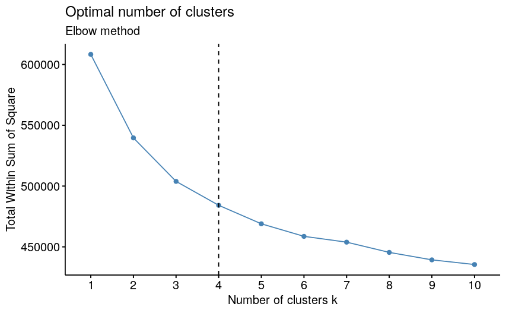
```

## DDLK Clusteing  
DDLk_Clust need the following inputs  

* PathwayScore: Pathway enrichment score matrix. We get this from 
    PathwayEnrichmentScore_output$Pathway_score  
* PathwayMetaData: Pathways metadata. we get this from
    PathwayEnrichmentScore_output$Pathway_metadata  
* n: Number of clusters for K-means clustering. We can determine the
    optimal number of clusters for pathway enrichment score matrix using
    the Elbow method, Average silhouette method, Gap statistic method.  
* out.dir: Directory to save enrichment score. This input is mandatory.
    Default is your current directory.  
* MetaData: list of metadata for all expression matrices. This input is
    optional. Only give if you have the same columns in all 
    metadata matrices.  

```{r DDLK-Clustering,  eval=F, echo=T}
# DDLK_Clust use python environment so set python environment before running DDLK_Clust()
# Set Python3 Path: Example: Sys.setenv(RETICULATE_PYTHON = "/usr/bin/python3")

Sys.setenv(RETICULATE_PYTHON = "/path/to/python3") 
library(reticulate)

#Retrive information about the version of python being used by reticulate
reticulate::py_config()
#If version is different from the the given path then restart session and
#give path again can change path

DDLK_Clusters = unCTC::DDLK_Clust(PathwayScore = Pathway_score$Pathway_score,
                           PathwayMetaData = Pathway_score$Pathway_metadata,
                           n = 4,
                           out.dir = getwd(),
                           MetaData = MetaData
                           )


```

## unCTC plots:
unCTC_plots Plots principal components of pathway enrichment score.  

* Return list of three plots:group_by_Class,
group_by_Cluster,p1_p5_Pairssplot

Required input for unCTC_plots method is:  

* PathwayScore: Pathway enrichment score matrix. We get this from
    PathwayEnrichmentScore_output$Pathway_score.  
* PathwayMetaData: Pathways metadata. we get this from
    PathwayEnrichmentScore_output$Pathway_metadata.  
* colorby: Any column name from PathwayMetaData,
    default is "Data_id".  
* Color_cluster: Any column name from PathwayMetaData,
    default is "Clusters".  
* pairsplotLegend: Legend Position in pairsplot.
    Choose one from "left","right" and "none"  

```{r unCTC-Plots,  eval=F, echo=T}
plots = unCTC::unCTC_plots(Pathway_score = DDLK_Clusters$Pathway_score,
                    Pathway_metadata = DDLK_Clusters$PathwayDDLK_clust,
                    colorby = "Data_id",
                    Color_cluster = "Clusters",
                    pairsplotLegend = "none")

```

### PCA plots 

```{r PCA plots,  eval=F, echo=T}
plot_grid(plots$group_by_Class_PCA,plots$group_by_Cluster_PCA)
```

```{r, echo=FALSE, fig.align='center', fig.height=7, fig.width=15,out.width="70%"}
 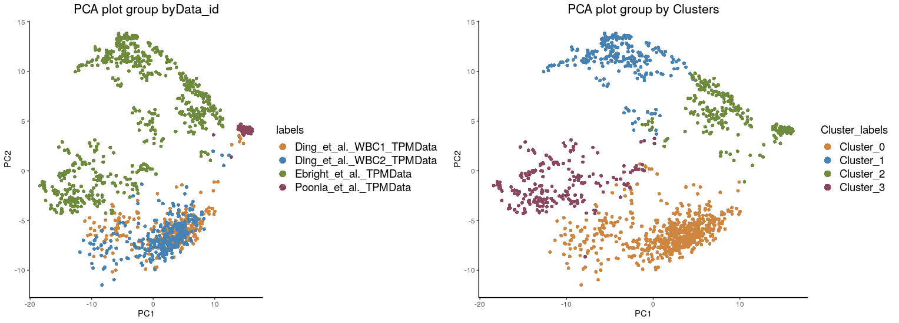
```

### UMAP plots 
```{r UMAP plots, eval=FALSE, include=FALSE}
plot_grid(plots$group_by_Class_umap,plots$group_by_Cluster_umap)
```

```{r Group-by-class_1, echo=FALSE, fig.align='center', fig.height=7, fig.width=15,out.width="70%"}
 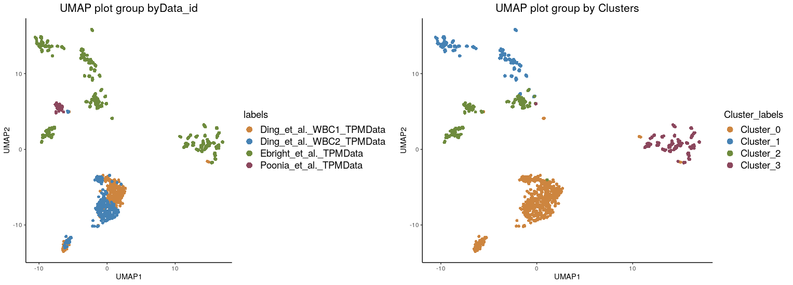
```


* stacked  bar plot shows the count of CTCs (red) and WBCs (blue),
    while the x-axis shows clusters.
```{r Counts-per-cluster,  eval=F, echo=T}
library(ggplot2)
ggplot(DDLK_Clusters$PathwayDDLK_clust, aes(x=Clusters, fill = Cell_type))+
       theme_classic()+
       geom_bar(stat="count")+
       scale_color_manual()+
       scale_fill_manual(
       values = c("deepskyblue3","darkred",
               "darkgreen","dark turquoise"))
```
```{r Counts per cluster_1,echo=FALSE, out.width="80%",fig.align='center'}
 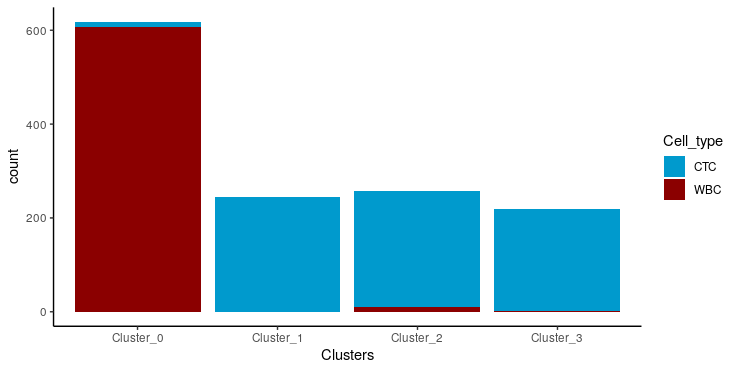
```

## Differential genes 
Provide differential genes between given groups.  
  
Differential_genes require following inputs:  

* data_list: List of expression data matrices  
* min_Sample: filter out genes which are not expressedin at least 
min_Sample cells, Default is 5  
* min_Gene: Filter out those cells which do not express at least 
min_Gene genes, Default is 1500.  
* DDLK_Clusters: output of DDLK_Clust()  
* data_id: List of expression data matrices name in same order.  
* data_type: choose from given vector,c("Normalised","Raw").
* DifferentiateBy: Default is Clusters. We can choose any column name
from DDLK_Clusters$PathwayDDLK_clust  
* p_val = Threshold p-value, Default is 0.05
* lfc = Threshold log fold change value, Default is 0
* up_gene_number = Select number of upregulated genes you want to obtain.
Default is 10. If you get an error when computing the number of upregulated
genes, relax the p val parameter.

```{r Differential-gene-matrix, eval=F, echo=T}
Diff_matrix = unCTC::Differential_genes(data_list=dataList,
                                 min_Sample = 5,
                                 min_Gene = 1500,
                                 DDLK_Clusters,
                                 Genesets = genesets,
                                 data_id=dataId,
                                 data_type = "Normalised",
                                 DifferentiateBy = "Clusters",
                                 up_gene_number = 200)
```

### Heatmap showing the top 200 upregulated genes in the 4 clusters.
```{r Differential-gene-matrix-pheatmap,  eval=F, echo=T}
library(pheatmap)
library(viridis)
annotation = Diff_matrix$annotations
annotation$Data_id <- NULL
annotation$GroupID <- NULL
annotation$Cell_type <- NULL
ann = annotation[,c("HormoneStatus","Class","Clusters")] 

pheatmap(t(scale(t(Diff_matrix$DiffMat))),cluster_cols = FALSE,
         show_colnames = FALSE,cluster_rows = FALSE, show_rownames = FALSE,
         color = viridis(1000),annotation = ann)
```
```{r Differential-gene-matrix-pheatmap_1, echo=FALSE, out.width="80%",fig.align='center'}
 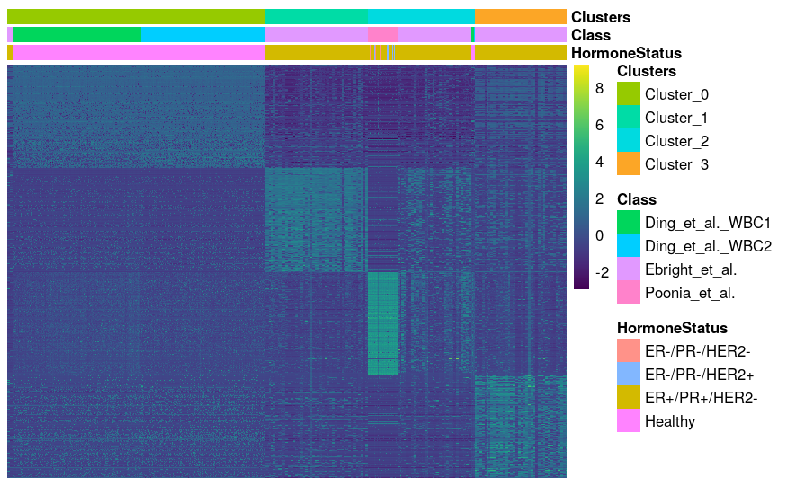
```

## Differential Pathways
Provide differential pathways between given groups.  
  
Differential_pathways require following inputs:  

* Pathway_score: Output of PathwayEnrichmentScore.R method  
* DDLK_Clusters: output of DDLK_Clust.R method  
* DifferentiateBy: Default is Clusters. We can choose any column name
from DDLK_Clusters$PathwayDDLK_clust  
* p_val = Threshold p-value, Default is 0.05
* lfc = Threshold log fold change value, Default is 0
* up_pathways_number = Select number of upregulated pathways you want to obtain.
Default is 10. If you get an error when computing the number of upregulated
pathways, relax the p val parameter.

### Top 100 upregulated pathways in each cluster
```{r Top100-Diff-Pathways, eval=F, echo=T}
Diff_path = unCTC::Differential_pathways(Pathway_score,
                      DDLK_Clusters = DDLK_Clusters,
                      DifferentiateBy = "Clusters",
                      up_pathways_number = 100
                      )
```

### Out of top 100 upregulated pathways in each cluster we select relevent pathways from each cluster
```{r Specific-Pathways,  eval=F, echo=T}
annotation = Diff_path$annotations
annotation$Data_id <- NULL
annotation$GroupID <- NULL
annotation$Cell_type <- NULL
ann = annotation[,c("HormoneStatus","Class","Clusters")] 
Specific_pathways = c("BIOCARTA_THELPER_PATHWAY","BIOCARTA_TCYTOTOXIC_PATHWAY","BIOCARTA_CTL_PATHWAY","BIOCARTA_IL17_PATHWAY","BIOCARTA_CTLA4_PATHWAY","LEE_DIFFERENTIATING_T_LYMPHOCYTE","BIOCARTA_MONOCYTE_PATHWAY",
"ZHENG_FOXP3_TARGETS_IN_T_LYMPHOCYTE_DN","SPIELMAN_LYMPHOBLAST_EUROPEAN_VS_ASIAN_2FC_DN","GUTIERREZ_CHRONIC_LYMPHOCYTIC_LEUKEMIA_UP","GOERING_BLOOD_HDL_CHOLESTEROL_QTL_CIS",
"FARMER_BREAST_CANCER_CLUSTER_6","TURASHVILI_BREAST_NORMAL_DUCTAL_VS_LOBULAR_UP","YANG_BREAST_CANCER_ESR1_BULK_UP","NIKOLSKY_BREAST_CANCER_19Q13.1_AMPLICON",
"GINESTIER_BREAST_CANCER_ZNF217_AMPLIFIED_UP","HOLLERN_SOLID_NODULAR_BREAST_TUMOR_UP","FINETTI_BREAST_CANCER_KINOME_RED","NIKOLSKY_BREAST_CANCER_7Q21_Q22_AMPLICON",
"YANG_BREAST_CANCER_ESR1_UP","GINESTIER_BREAST_CANCER_ZNF217_AMPLIFIED_UP","WP_MAMMARY_GLAND_DEVELOPMENT_PATHWAY_INVOLUTION_STAGE_4_OF_4","MACLACHLAN_BRCA1_TARGETS_UP",
"REACTOME_ERBB2_ACTIVATES_PTK6_SIGNALING","REACTOME_PI3K_EVENTS_IN_ERBB2_SIGNALING","REACTOME_PI3K_EVENTS_IN_ERBB4_SIGNALING","REACTOME_SHC1_EVENTS_IN_ERBB2_SIGNALING","REACTOME_GRB2_EVENTS_IN_ERBB2_SIGNALING")
mat = Diff_path$DiffMatpathway[Specific_pathways,]
pheatmap(t(scale(t(mat))),cluster_cols = FALSE,
         show_colnames = FALSE,cluster_rows = FALSE, show_rownames = TRUE, fontsize_row =7,fontsize = 7,
         color = viridis(1000),annotation = ann)
```


### Out of top 100 upregulated pathways in each cluster we select relevent pathways from each cluster
```{r Specific-Pathways-pheatmap,echo=FALSE, out.width="100%",fig.align='center'}
 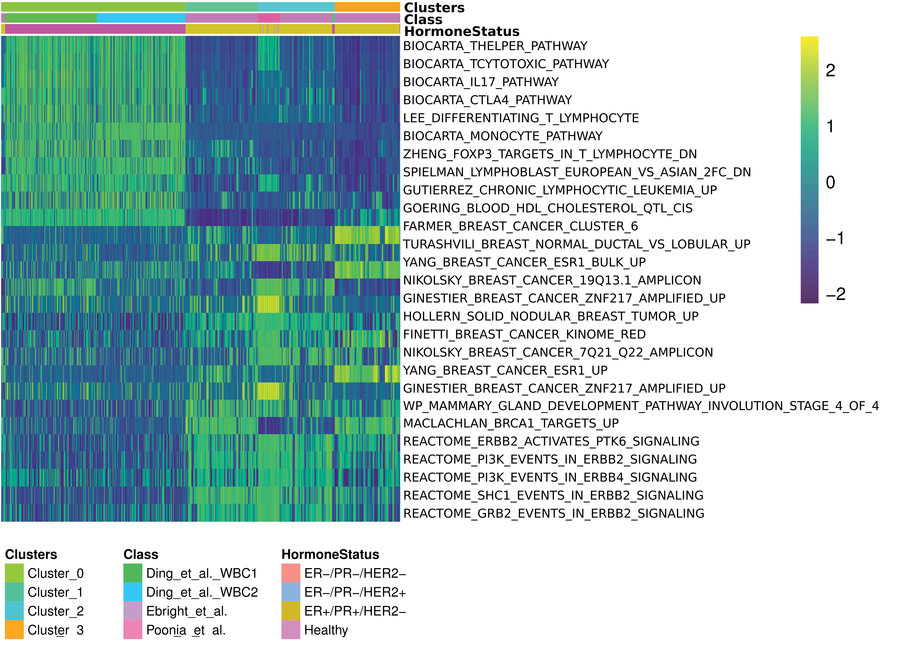
```

## Calcuate Stouffers score
Stouffer_score method uses the following steps:  

* Calculate Z score of log normalized data  
* Calculate Stouffer score for the specific gene list  
* Assign Stouffer score to different groups of data and
    results are shown in boxplot  

The followings input are required to calculate Stouffer's score:  

* data_list: List of expression data matrices.  
* min_Sample: filter out genes which are not expressedin at least 
min_Sample cells, Default is 5.  
* min_Gene: Filter out those cells which do not express at least 
min_Gene genes, Default is 1500. 
* data_id: List of expression data matrices name in the same order.  
* gene_list: Specific genes in vector.  
* MetaData: Optional, List of metadata of expression matrices. If given,
    then columns of all metadata in the list must be the same.  
* metaColPos: default = 1,Only require if metadata is given. Position of
    the column in metadata for which we want to calculate and compare Stouffer
    score for given gene list.  
* metaColName: default = "Class", Only require if metadata is given.  
    Name of the column in metadata for which we want to calculate and compare
    Stouffer score for given gene list.  
    
With this package, we have given two types of gene list:  

### Load genelists
```{r Load-genelists, eval=F, echo=T}
Breast_elevated_genes = unCTC::Breast_elevated_genes
Immune_signature_genes = unCTC::Blood_specific_gene

```

### Stouffer's Score:
```{r Calculate-Stouffer-score,  eval=F, echo=T}
#Calculate Stouffer's score for Blood gene
S_WBC = unCTC::Stouffer_score(data_list = dataList,
                         min_Sample = 5,
                         min_Gene = 1500,
                         gene_list =Immune_signature_genes,
                         data_id = dataId,
                         Groupby = "Clusters",
                         DDLKCluster_data = DDLK_Clusters)


#Calculate Stouffer's score for Breast elevated genes
S_Breast = unCTC::Stouffer_score(data_list = dataList,
                           min_Sample = 5,
                           min_Gene = 1500,
                           gene_list = Breast_elevated_genes,
                           data_id = dataId,
                           Groupby = "Clusters",
                           DDLKCluster_data = DDLK_Clusters)
```

## Stouffer's Score Plot
For better colour visualization we are using following color key:
```{r Colorkey,  eval=F, echo=T}
library(ggplot2)
library(ggpubr)
ColorKey = c("darkred","deepskyblue3","darkolivegreen4",
             "dark turquoise","pale violet red",
             "steelblue","forestgreen","gray2",
             "gray50","hotpink","lightslateblue",
             "tan4","yellow3","sienna4","orchid4")
```

### For Immune genes:
```{r Immune-genes-Stouffer, eval=F, echo=T}
ggplot(S_WBC$Stouffer_score,aes(x=Clusters,y= Stouffer_score,fill=Clusters))+
geom_boxplot(outlier.shape = NA) + theme_classic() +
scale_fill_manual(values = ColorKey) +
ggtitle("Immune gene signature")+
stat_compare_means(comparisons = S_WBC$comparisons,
label = "p.signif", method = "t.test",ref.group = ".all.")
```
```{r Immune-genes-Stouffer_1, echo=FALSE, out.width="80%",fig.align='center'}
 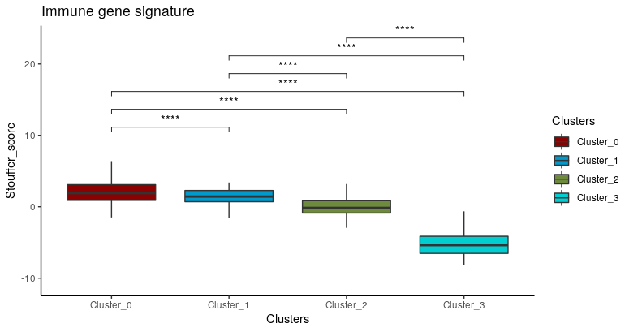
```


### For Breast elevated genes:
```{r Breast-genes-Stouffer, eval=F, echo=T}
ggplot(S_Breast$Stouffer_score,aes(x=Clusters,y= Stouffer_score,fill=Clusters))+
geom_boxplot(outlier.shape = NA) + theme_classic() +
scale_fill_manual(values = ColorKey)+
ggtitle("Breast elevated gene signature")+
stat_compare_means(comparisons = S_Breast$comparisons,
label = "p.signif", method = "t.test",ref.group = ".all.")
```
```{r Breast-genes-Stouffer_1, echo=FALSE, out.width="80%",fig.align='center'}
 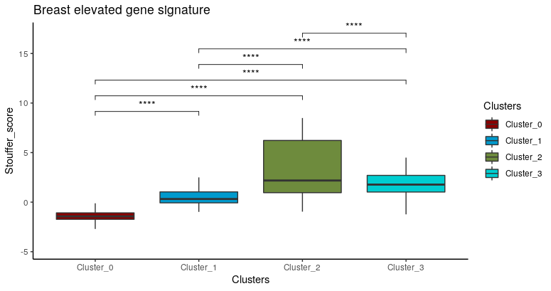
```

 
## Copy Number Variation Analysis:
inferCNV R package is used for analysing copy number variation for raw 
Count/TPM data. Along with all analysis of inferCNV, unCTC::CNV_alterations
calculate addition and deletion position in p and q arms in test/cancerous/
diseased data as compared to reference/normal/healthy. To calculate p and q
arm location from inferCNV events, we used GRCh37 cytoband information.  

CNV_alterations require the following inputs:  

* data_list: List of expression data matrices.  
* data_id: List of expression data matrices name in the same order.  
* path= path to save output files. 
* min_Sample: filter out genes which are not expressedin at least 
min_Sample cells, Default is 5.  
* min_Gene: Filter out those cells which do not express at least 
min_Gene genes, Default is 1500. 
* GenePositionFile: Gene/chromosomal order file. This package includes
    genecode hg19 gene order file. Either you can use this or download it
    from outer sources.  
* threads_no: Thread number for parallel processes, default is 8.  
* MetaData: Optional, List of metadata of expression matrices. If given,
    then columns of all metadata in the list must be the same.  
* Groupby: Any column name from MetaData, which we want to use as an
    annotation file. Only applicable if MetaData is given.  
* Reference_name: Any cell type from the data_id list or any cell type
    from the column assign to Groupby.  
* obs.title: Title of test/observation matrix. Default is "Observations".  
* ref.title: Title of reference matrix. Default is "References".  
* out.Filename: Output filename-prefix. Default is "inferCNV".  

### Load gene order file
```{r  eval=F, echo=T}
gencode_v19_gene_pos =unCTC::gencode_v19_gene_pos
```

### InferCNV between Poonia et al.'s CTCs and WBCs
```{r  eval=F, echo=T}
ref_data = unCTC::Poonia_et_al._PBMC_CountData
ref_metadata = unCTC::Poonia_et_al._PBMC_metaData
obs_data = unCTC::Poonia_et_al._CountData
obs_metadata = unCTC::Poonia_et_al._metaData
dataList1 = list(ref_data,obs_data)
dataId1 = list("WBC","CTC")
MetaData1= list(ref_metadata,obs_metadata)

CNV_Alterations1 = unCTC::CNV_alterations(
                                    data_list= dataList1,
                                    data_id= dataId1,
                                    min_Sample = 5,
                                    min_Gene = 1500,
                                    path= getwd(),
                                    GenePositionFile= gencode_v19_gene_pos,
                                    threads_no=8,
                                    MetaData = MetaData1,
                                    Groupby = "GroupID",
                                    Reference_name = c("WBC"),
                                    obs.title ="Observations",
                                    ref.title = "References",
                                    cluster_by_groups = TRUE,
                                    out.Filename = "inferCNV"
                                    )

```

### CNV States
```{r echo=FALSE}
print("HMM state (1 = 2 copies loss, 2 = 1 copy loss, 3 = neutral,4 = 1 copy gain, 5 = 2 copies gain, 6 = 3+ copies gain),")

```
```{r eval=F, echo=T}
head(CNV_Alterations1)
```


```{r inferCNV_p-q_arm-alterations,echo=FALSE, out.width="100%",fig.align='center'}
 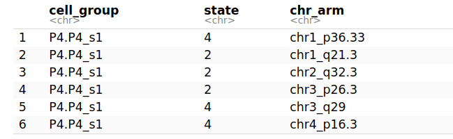
```

```{r inferCNV-heatmap-ref-WBC-cluster,echo=FALSE, out.width="100%",fig.align='center'}

  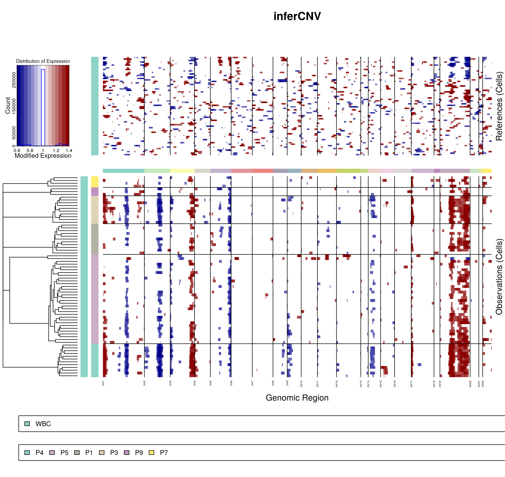


```

### InferCNV by taking Ebright et al.'s CTCs as observation
```{r CNV-Alterations_dataID, eval=F, echo=T}
load("/home/saritap/unCTC_datasets/GSE181279_Countdata.RData")
ref_data = GSE181279_Countdata
load("/home/saritap/unCTC_datasets/Ebright_et_al._CountData.RData")
obs_data = Ebright_et_al._CountData

dataList = list(ref_data,obs_data)
dataId = list("WBC","CTC")


CNV_Alterations2 = unCTC::CNV_alterations(
                     data_list= dataList,
                     data_id= dataId,
                     min_Sample = 5,
                     min_Gene = 1500,
                     path= "/home/saritap/u1",      
                     GenePositionFile= gencode_v19_gene_pos,  
                     threads_no=8, 
                     Groupby = "Data_id",
                     Reference_name = c("WBC"), # WBC data as reference
                     obs.title ="Observations", 
                     ref.title = "References",
                     out.Filename = "inferCNV" 
                     )

```
### CNV States
```{r echo=FALSE}
print("HMM state (1 = 2 copies loss, 2 = 1 copy loss, 3 = neutral,4 = 1 copy gain, 5 = 2 copies gain, 6 = 3+ copies gain),")

```
```{r eval=F, echo=T }
head(CNV_Alterations2)
```

```{r inferCNV_p-q_arm-alterations between DataId,echo=FALSE, out.width="100%",fig.align='center'}
 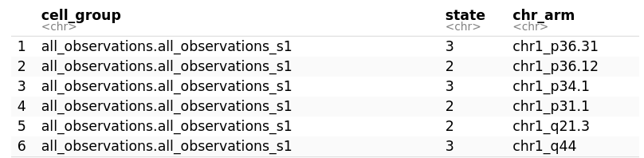
```
```{r inferCNV-heatmap-WBC-Ref between DataId,echo=FALSE, out.width="100%",fig.align='center'}

  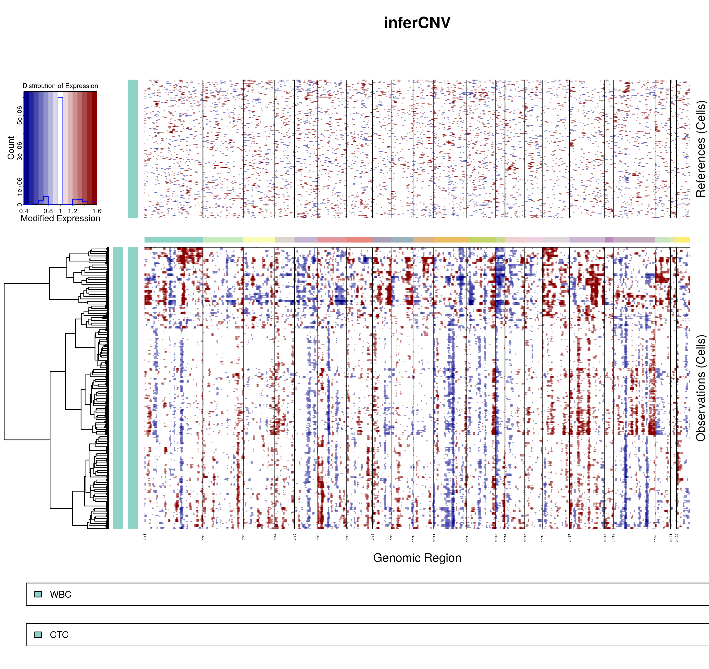

```

## Gene_Violin_plots 
Give violin plot for a given Canonical marker expression.  

Gene_Violin_plots require input:  
* data_list: List of expression data matrices  
* data_id: List of expression data matrices name in the same order.  
* min_Sample: filter out genes which are not expressedin at least 
min_Sample cells, Default is 5.  
* min_Gene: Filter out those cells which do not express at least 
min_Gene genes, Default is 1500. 
* gene_symbol: Specific gene for which we want to see expression.  
* MetaData:  Optional, list of metadata of expression matrices.
    If given then columns of all metadata in the list must be identical.  
* Groupby: Any column name from MetaData, which we want to use to see
    differential expression of the gene. Default is "data_id".  
    
```{r Gene-Violin-Plot, eval=F, echo=T}
# Gene Violin plot
PTPRC = Gene_Violin_plots(data_list =dataList,
                  data_id = dataId,
                  min_Sample = 5,
                  min_Gene = 1500,
                  gene_symbol = "PTPRC",
                  DDLKCluster_data = DDLK_Clusters$PathwayDDLK_clust,
                  Groupby = "Clusters")
NKG7 = Gene_Violin_plots(data_list =dataList,
                  data_id = dataId,
                  min_Sample = 5,
                  min_Gene = 1500,
                  gene_symbol = "NKG7",
                  DDLKCluster_data = DDLK_Clusters$PathwayDDLK_clust,
                  Groupby = "Clusters")

EPCAM = Gene_Violin_plots(data_list =dataList,
                  data_id = dataId,
                  min_Sample = 5,
                  min_Gene = 1500,
                  gene_symbol = "EPCAM",
                  DDLKCluster_data = DDLK_Clusters$PathwayDDLK_clust,
                  Groupby = "Clusters")
KRT18 = Gene_Violin_plots(data_list =dataList,
                  data_id = dataId,
                  min_Sample = 5,
                  min_Gene = 1500,
                  gene_symbol = "KRT18",
                  DDLKCluster_data = DDLK_Clusters$PathwayDDLK_clust,
                  Groupby = "Clusters")
```

### Canonical marker expression
```{r Canonical-markers-expression, eval=F, echo=T}
library(cowplot)
plot_grid(PTPRC$Violin_plot,NKG7$Violin_plot,
          EPCAM$Violin_plot,KRT18$Violin_plot)
```
```{r Canonical-markers-expression_1,echo=FALSE, out.width="100%",fig.align='center'}
 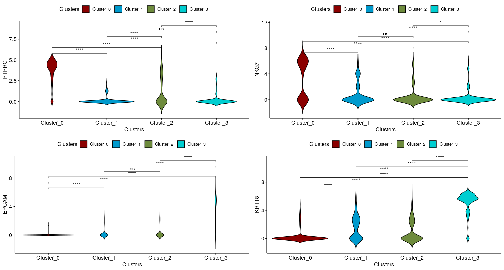
```


